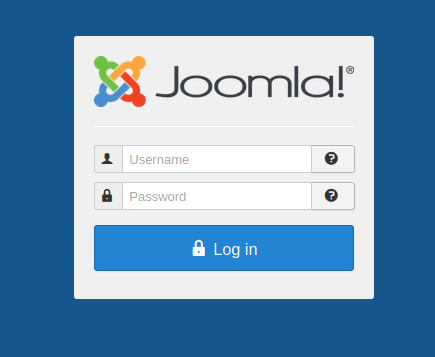

## Website

* `/administrator`


* `/language/en-GB/en-GB.xml`
```
<metafile version="3.7" client="site">
<name>English (en-GB)</name>
<version>3.7.0</version>
<creationDate>April 2017</creationDate>
<author>Joomla! Project</author>
<authorEmail>admin@joomla.org</authorEmail>
<authorUrl>www.joomla.org</authorUrl>
<copyright>
Copyright (C) 2005 - 2017 Open Source Matters. All rights reserved.
</copyright>
<license>
GNU General Public License version 2 or later; see LICENSE.txt
</license>
<description>en-GB site language</description>
<metadata>
<name>English (en-GB)</name>
<nativeName>English (United Kingdom)</nativeName>
<tag>en-GB</tag>
<rtl>0</rtl>
<locale>
en_GB.utf8, en_GB.UTF-8, en_GB, eng_GB, en, english, english-uk, uk, gbr, britain, england, great britain, uk, united kingdom, united-kingdom
</locale>
<firstDay>0</firstDay>
<weekEnd>0,6</weekEnd>
<calendar>gregorian</calendar>
</metadata>
<params/>
</metafile>
```
* looks like joomla is running on version 3.7