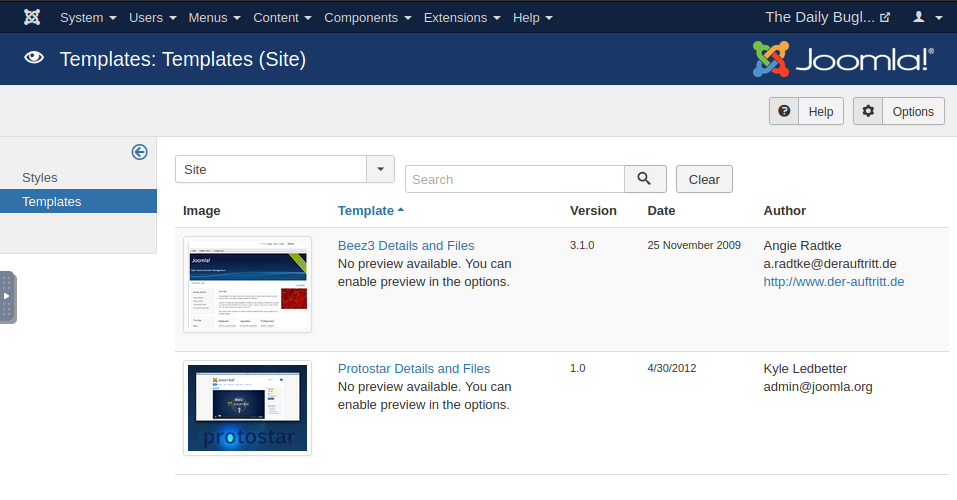
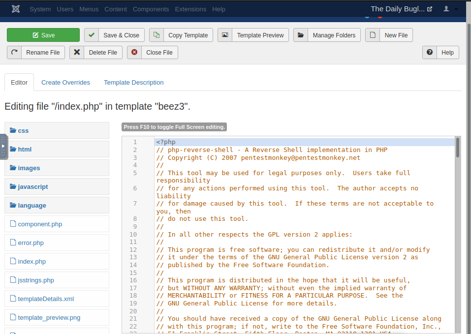
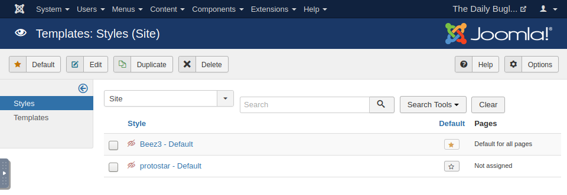

## Joomla - PHP Reverse Shell

* let's navigate to `extensions -> Templates -> Templates`

* navigate to Beez3 and edit `index.php`
* we can replace the default code with code from a php reverse shell script - http://pentestmonkey.net/tools/php-reverse-shell/php-reverse-shell-1.0.tar.gz

* let's navigate to `extensions -> Templates -> Styles`
* set Beez3 - Default to `Default for all pages` by clicking the star on the right hand side

* set up a netcat listener
* navigate back to homepage