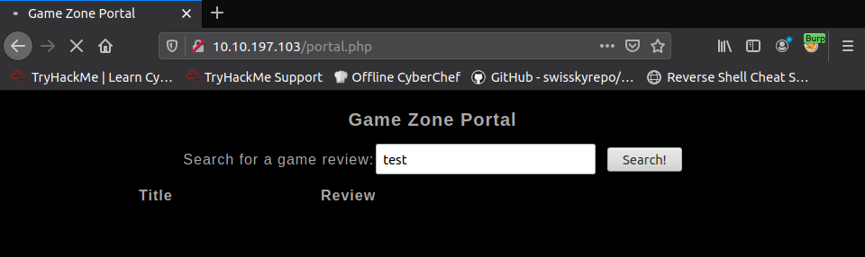

## Burpsuite

* intercept a search request for a game review



```
POST /portal.php HTTP/1.1
Host: 10.10.197.103
User-Agent: Mozilla/5.0 (X11; Ubuntu; Linux x86_64; rv:80.0) Gecko/20100101 Firefox/80.0
Accept: text/html,application/xhtml+xml,application/xml;q=0.9,image/webp,*/*;q=0.8
Accept-Language: en-US,en;q=0.5
Accept-Encoding: gzip, deflate
Content-Type: application/x-www-form-urlencoded
Content-Length: 15
Origin: http://10.10.197.103
Connection: close
Referer: http://10.10.197.103/portal.php
Cookie: PHPSESSID=30tmlb71oihei2va515g6ajst2
Upgrade-Insecure-Requests: 1

searchitem=test
```

* save this file to request.txt and use it to run sqlmap
