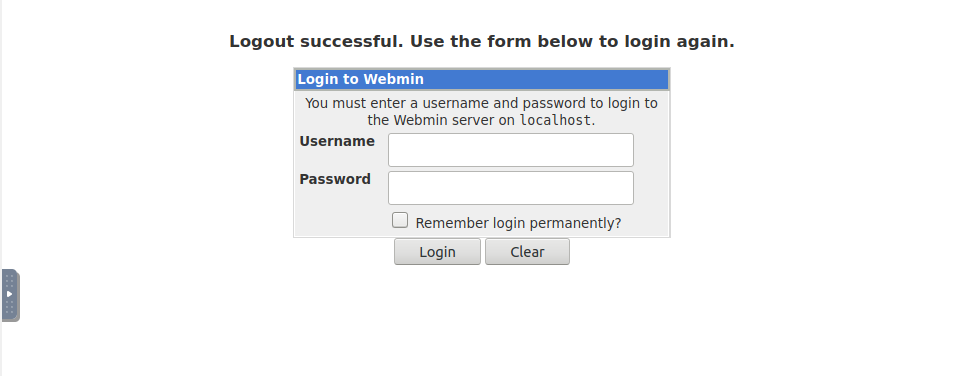
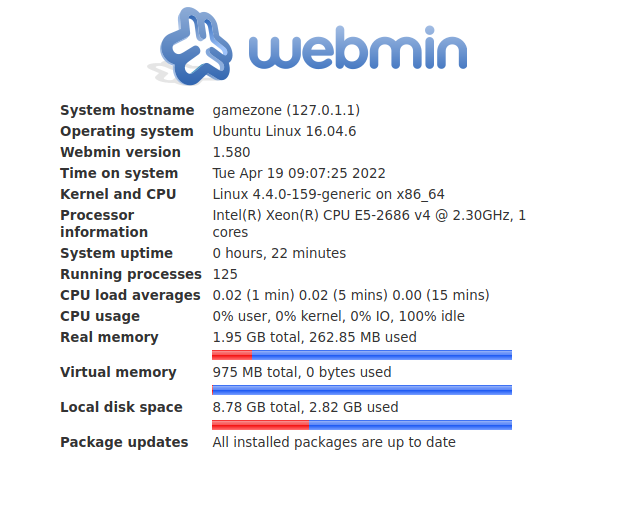

* `ss -tulnp` - show what socket connections are running on the host

```
agent47@gamezone:~$ ss -tulnp
Netid  State      Recv-Q Send-Q Local Address:Port               Peer Address:Port              
udp    UNCONN     0      0         *:10000                 *:*                  
udp    UNCONN     0      0         *:68                    *:*                  
tcp    LISTEN     0      128       *:10000                 *:*                  
tcp    LISTEN     0      128       *:22                    *:*                  
tcp    LISTEN     0      80     127.0.0.1:3306                  *:*                  
tcp    LISTEN     0      128      :::80                   :::*                  
tcp    LISTEN     0      128      :::22                   :::*
```           


*  `ssh -L 10000:localhost:10000 agent47@10.10.158.130`
* we can use the password we got previously
* navigate to localhost:10000

* we can reuse the username and password we got previously

* we can see that this box is running webmin 1.580