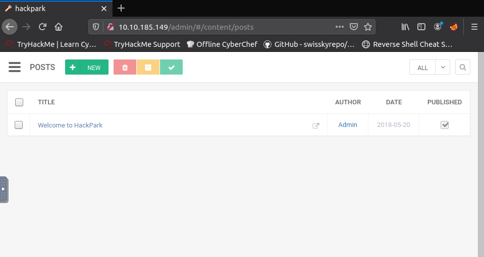
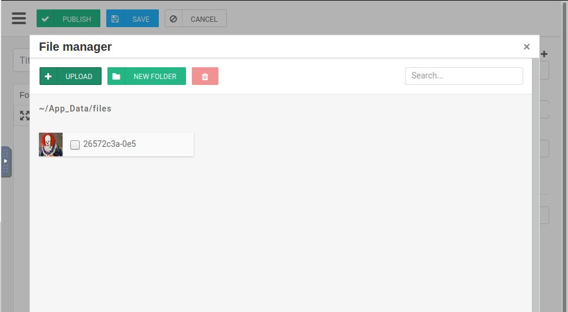

## BlogEngine.NET 3.3.6

CVE-2019-6714

* Upload malicious PostView.aspx file after editing IP address to attacker IP and port through File Manager
* File Manager can be found under Content->Posts->New

* set up netcat listener
* navigate to http://10.10.234.227/?theme=../../App_Data/files to execute payload
