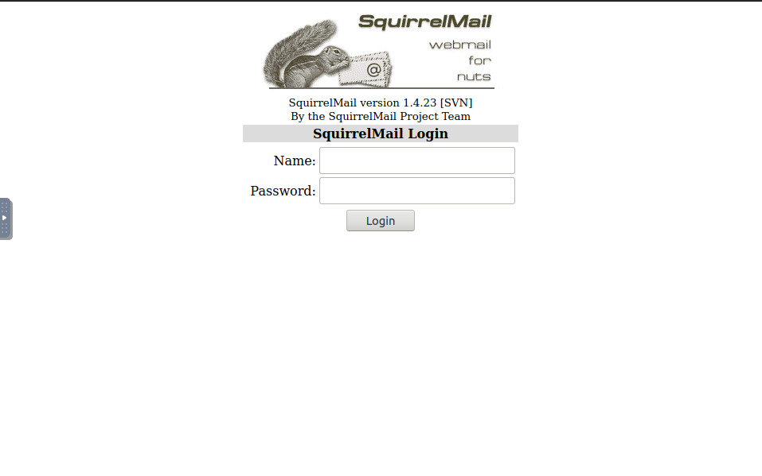

## Website

* directories from Gobuster all lead to 403 error except `/squirrelmail`

* `/squirrelmail`

* secret directory discovered in smb share `anonymous`

* `/45kra24zxs28v3yd/administrator/`

* googling `Cupa CMS exploitdb` tells me this is vulnerable to LFI
